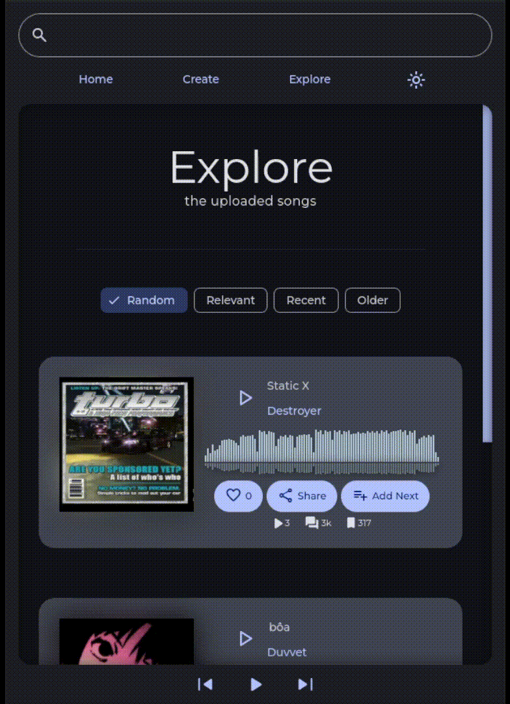

<a id="readme-top"></a>

<span align="center">

[![LinkedIn][linkedin-shield]][linkedin-url]

</span>

<br />

<h1 align="center">Audio Host</h1>

  <p align="center">
      A web application developed in TypeScript, reworking the functionality of several audio hosting and sharing web pages, allowing users to upload their songs. 
    <br />
    <br />
    <a href="https://www.youtube.com/watch?v=CBnGdF0QKCM">View Demo</a>

  </p>
</div>

## About The Project

The application is deployed using Docker, containerizing the backend, frontend, storage, and the server proxy, Nginx. More specifically, the application is written in TypeScript and powered by Node.js, utilizing NestJS for the backend, Svelte & Vite for the frontend, and MongoDB for data storage.

It emulates the functionality of briefly interacting with the content, such as giving likes or playing audio. Additionally, it emulates the sharing of a song, which involves uploading audio and image files that are sent to the server for storage and processing, similar to how a web application operates.

### Built With

- [![Docker][Docker]][Docker-url]
- [![NGINX][NGINX]][NGINX-url]
- [![NodeJS][NodeJS]][NodeJS-url]
- [![NPM][NPM]][NPM-url]
- [![Typescript][Typescript]][Typescript-url]
- [![NestJS][NestJS]][NestJS-url]
- [![MongoDB][MongoDB]][MongoDB-url]
- [![Vite][Vite]][Vite-url]
- [![Svelte][Svelte]][Svelte-url]
- [![MUI3][MUI3]][MUI3-url]

## Live demo

A live demo of this project is not available at this moment. This project may no longer be continued, but a video demonstration is available on YouTube:

<a href="https://www.youtube.com/watch?v=CBnGdF0QKCM">
  
</a>

## Local reproducing

You can reproduce this project on your preferred server, of course. All you need is a Linux-based system and Docker.

First clone the project and install it with NPM:

```
cd backend && sudo npm install && sudo npm audit fix
cd ..
cd frontend && sudo npm install && sudo npm audit fix
```

You may need to update the <b>'.env'</b> file, assuming you have a local SSL certificate and key; otherwise, create them:

```
sudo openssl req -nodes -new -x509 -keyout private.key -out certificate.crt -days 365
```

Create a '.keyfile' required to authenticate our database (replica set) against unauthorized access:

```
sudo openssl rand -base64 756 > mongo/.keyfile
# and, to avoid permission projects while building and copying the file between the system (not recommended for production)
sudo chmod 400 mongo/.keyfile && sudo chown 999:999 mongo/.keyfile
```

Then build the build the docker containers:

```
docker compose up -d
# then run it
docker run $(docker ps -a -q)
```

Done, your project should be running at HTTPS!

## License

Distributed under the MIT License.

## Contact

Guido Moran - guidomoran.ap@gmail.com

Project Link: [https://github.com/guidoow/Audiohost](https://github.com/Guidoow/Audiohost)

[linkedin-shield]: https://img.shields.io/badge/-LinkedIn-black.svg?style=for-the-badge&logo=linkedin&colorB=555
[linkedin-url]: https://linkedin.com/in/guidoow/
[Docker]: https://img.shields.io/badge/Docker-2CA5E0?style=for-the-badge&logo=docker&logoColor=white
[Docker-url]: https://www.docker.com/
[NGINX]: https://img.shields.io/badge/Nginx-009639?style=for-the-badge&logo=nginx&logoColor=white
[NGINX-url]: https://nginx.org/
[NodeJS]: https://img.shields.io/badge/Node%20js-339933?style=for-the-badge&logo=nodedotjs&logoColor=white
[NodeJS-url]: https://nodejs.org/
[NPM]: https://img.shields.io/badge/npm-CB3837?style=for-the-badge&logo=npm&logoColor=white
[NPM-url]: https://www.npmjs.com/
[Typescript]: https://img.shields.io/badge/TypeScript-007ACC?style=for-the-badge&logo=typescript&logoColor=white
[Typescript-url]: https://www.typescriptlang.org/
[NestJS]: https://img.shields.io/badge/nest%20js-E0234E?style=for-the-badge&logo=nestjs&logoColor=white
[NestJS-url]: https://nestjs.com/
[MongoDB]: https://img.shields.io/badge/MongoDB-4EA94B?style=for-the-badge&logo=mongodb&logoColor=white
[MongoDB-url]: https://www.mongodb.com
[Vite]: https://img.shields.io/badge/Vite-B73BFE?style=for-the-badge&logo=vite&logoColor=FFD62E
[Vite-url]: https://vitejs.dev/
[Svelte]: https://img.shields.io/badge/Svelte-4A4A55?style=for-the-badge&logo=svelte&logoColor=FF3E00
[Svelte-url]: https://svelte.dev/
[MUI3]: https://img.shields.io/badge/MaterialUI3-007FFF?style=for-the-badge&logo=mui&logoColor=white
[MUI3-url]: https://m3.material.io/
